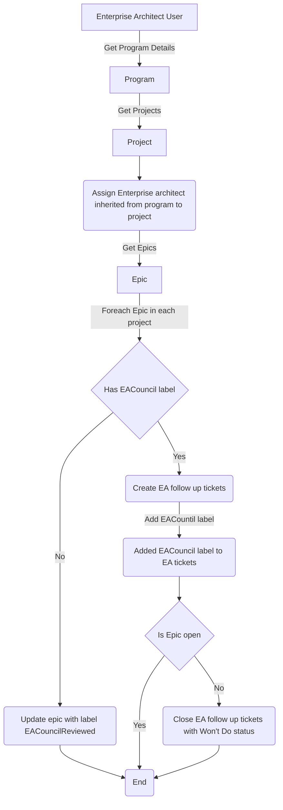

# Jira Admin

## Purpose
The purpose of this automation is to backfill our tickets with a defined strategy

## Prerequisites
* python
* pip
* Generate an [jira api token](https://id.atlassian.com/manage-profile/security/api-tokens)

## Execution

```shell
./main.py -ju YOUR_USER@ipsy.com -jt YOUR_JIRA_API_TOKEN -t YOUR_TPM 
Connected to pydev debugger (build 233.13135.95)
```
* Note that by default will dry run making an analysis on your program unless you pass `--run` then will perform changes

## Logic of the backfill


* Note that this is idempotent, it will always produce the same result, it wont duplicate tickets